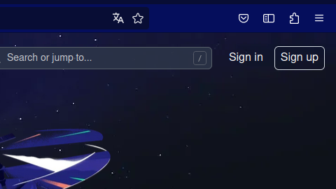
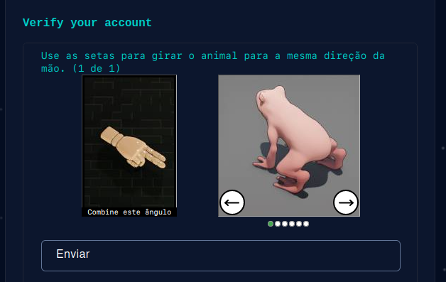
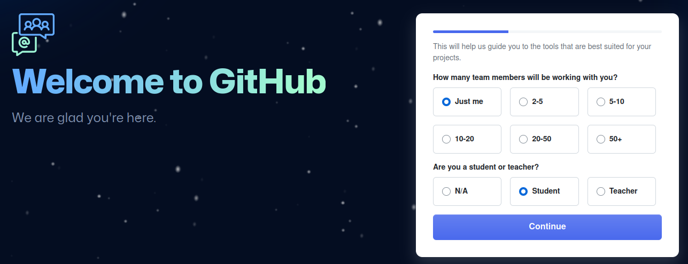
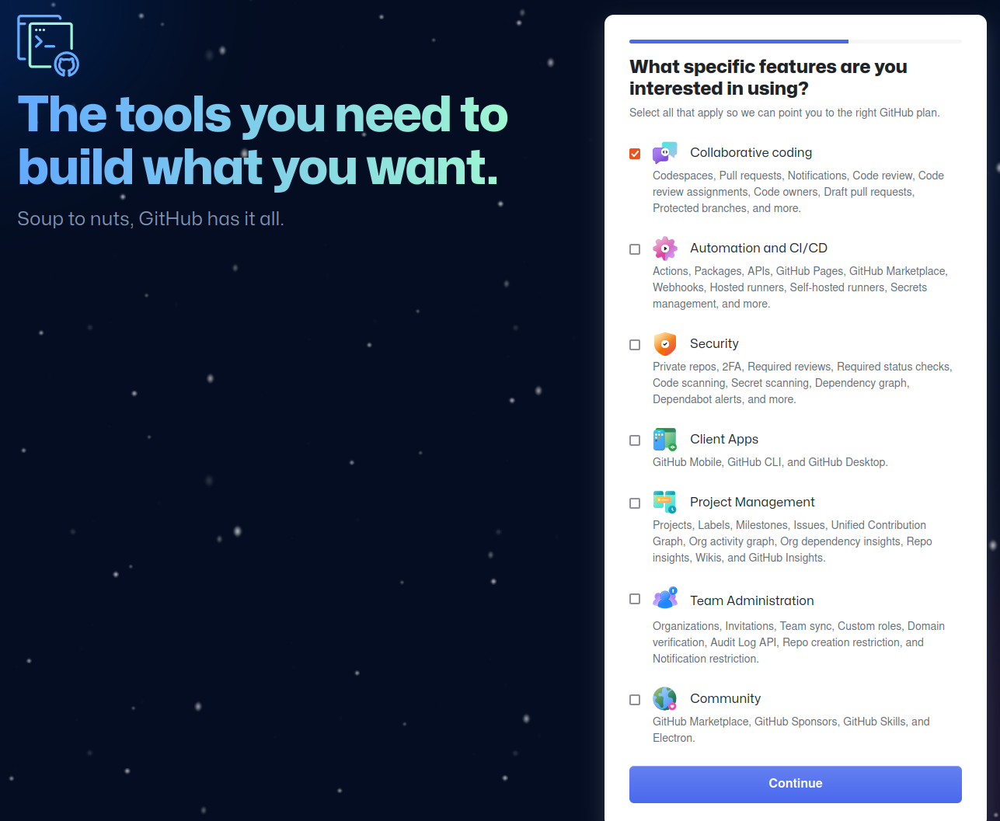
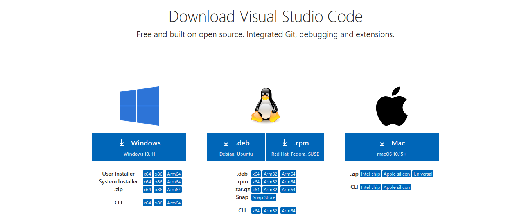
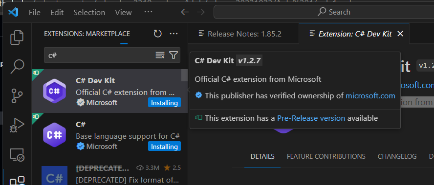

<style>
img[alt$="<"] {
    float: left;
    margin-right: 2em;
    }
</style>
# Educafro Tech
## Curso C# - Do Básico ao MVC
---
# Agenda
1. Introdução à Programação e Ambiente de Desenvolvimento
2. Fundamentos da Programação em C#
3. Programação Orientada a Objetos (POO)
4. Desenvolvimento Web com ASP.NET MVC
5. Banco de Dados SQL Server e Entity Framework
6. Construção de um Aplicativo Web MVC
7. Implementando Recursos Avançados
8. Melhores Práticas e Testes
9. Projetos e Aplicações Futuras

---
### 1. Introdução à Programação e Ambiente de Desenvolvimento

---
### 1. Introdução à Programação e Ambiente de Desenvolvimento
#### 1.1. Quem sou eu?

---
<style scoped>section { justify-content: start; }</style>

#### 1.1. Quem sou eu?

 Roberto de Oliveira Santos
37 anos
Gerente @ Itaú Unibanco
Homem negro, apaixonado por tecnologia e por agilidade

##### Formação
Tecnologia da Informação @ Fatec Jundiaí (2007)
Arquitetura e Sistemas .Net @ FIAP (2013)
MBA Executivo @ Insper (2021) 

> Linkedin: https://www.linkedin.com/in/robertoosantos/

---
### 1. Introdução à Programação e Ambiente de Desenvolvimento
#### 1.1. GitHub
##### 1.1.1. Criando sua conta

---
<style scoped>section { justify-content: start; }</style>

### 1. Introdução à Programação e Ambiente de Desenvolvimento
#### 1.1. GitHub
> A plataforma de desenvolvedores baseada em IA para criar, dimensionar e fornecer software seguro.

Link: https://github.com/

---
### 1. Introdução à Programação e Ambiente de Desenvolvimento
##### 1.1.1. Criando sua conta
1. Clique em ***Sign Up*** no canto superior direito


---
<style scoped>section { justify-content: start; }</style>

##### 1.1.1. Criando sua conta

2. Será solicitado seu **e-mail** e a criação de uma **senha**.
> Se você não tiver um e-mail, você pode criar um em: https://gmail.com
3. Será solicitada a criação de um **nome de usuário**.
> Futuros contratantes verão seu nome de usuário. Sugiro utilizar algo similar ao seu nome. Ex.: rafa-silva-dev, devmariasouza, anasilva-dev
4. Se você quer notícias sobre o github por e-mail responda ***y*** para **sim**, ou ***n*** para **não**.

---
<style scoped>section { justify-content: start; }</style>

##### 1.1.1. Criando sua conta

5. Ao final, você terá que resolver um desafio para confirmar que você é um usuário e não uma máquina. Ex.:


---
<style scoped>section { justify-content: start; }</style>

##### 1.1.1. Criando sua conta

6. Clique em **Create account** para criar sua conta.
7. Um código com 8 números vai ser enviado para seu **e-mail**. Acesse seu e-mail numa nova aba ou janela e digite nessa tela o **código enviado por e-mail**.

---
<style scoped>section { justify-content: start; }</style>

##### 1.1.1. Criando sua conta

8. Agora você deve configurar sua conta.
Recomendo que você selecione:
* ***Just me*** (apenas eu)
* ***Student*** (estudante)


---
<style scoped>section { justify-content: start; }</style>

##### 1.1.1. Criando sua conta

9. Selecione quais recursos pretende utilizar. Recomendo selecionar somente **'Collaborative coding'** e, no final da página, selecione **Continue**. 


---

##### 1.1.1. Criando sua conta
<style scoped>section { justify-content: start; }</style>

10. Finalmente, serão oferecidos os tipos de conta que você deseja. Selecione ***Free*** (Grátis) e no final da página clique em **Continue for free**.


---
<style scoped>section { justify-content: start; }</style>

##### 1.1.1. Criando sua conta

#### Parabéns! 👏
Agora você possui uma conta na maior plataforma de desenvolvimento do mundo!

---
### 1. Introdução à Programação e Ambiente de Desenvolvimento
#### 1.2. Visual Studio Code
#### 1.2.1. Instalação

---
<style scoped>section { justify-content: start; }</style>

### 1. Introdução à Programação e Ambiente de Desenvolvimento
#### 1.2. Visual Studio Code
> Edição de código. Redefinido. Grátis. Construído em open source. Roda em qualquer lugar.


Link: https://code.visualstudio.com/download

---
<style scoped>section { justify-content: start; }</style>

##### 1.2.1 Instalação
1. Selecione a versão desejada. Se o seu computador for 32 ou 64 bits e para qual Sistema Operacional você deseja. (Windows, Linux, MacOS...)
> No meu caso estou usando o Linux Ubuntu 22.04 64bits



---
<style scoped>section { justify-content: start; }</style>

##### 1.2.1 Instalação
2. Clique duas vezes no arquivo baixado e siga as instruções para instalação.

3. **Pronto**, você tem uma das ferramentas mais populares de programação, disponível para utilização.

---
### 1. Introdução à Programação e Ambiente de Desenvolvimento
#### 1.2. Visual Studio Code
#### 1.2.1. Configuração

---
<style scoped>section { justify-content: start; }</style>

##### 1.2.2 Configuração

No lado esquerdo você encontrará as funcionalidades do visual studio.

1. Clique em **Extensões** e pesquise por C#
2. Instale a extensão com a descrição ```Base language support for C#```.




---
<style scoped>section { justify-content: start; }</style>

##### 1.2.2 Configuração

Agora vamos instalar o .Net SDK*
> Crie. Teste. Implante. O .NET é a estrutura gratuita, de software livre e multiplataforma para compilar aplicativos modernos e serviços de nuvem poderosos.

> \* SDK significa *Software Development Kit*, ou seja, kit para desenvolvimento de software. Esse é um conceito que existe para diversas tecnologias.

Link: https://dotnet.microsoft.com/pt-br/download

---
<style scoped>section { justify-content: start; }</style>

##### 1.2.2 Configuração

#### Parabéns! 🎉🎉
Agora você está pronto para começar a desenvolver em C#!

---
### 1. Conceitos Básicos
#### 1.3. O que é programação?

---
#### 1.3. O que é programação?

> Programação é o processo de escrita, teste e manutenção de um programa de computador. O programa é escrito em uma linguagem de programação, embora seja possível, com alguma dificuldade, o escrever diretamente em linguagem de máquina. Diferentes partes de um programa podem ser escritas em diferentes linguagens.
**Wikipedia*

A principal linguagem que utilizaremos nesse curso será C#

---

#### 1.3. O que é programação?

Para facilitar o entendimento, imagine um programa de computador como um conjunto de funções que permite que as pessoas façam algo sem entender detalhadamente como um computador funciona.

##### Vamos praticar! ✏️

Numa folha de papel escreva as funções que você imagina que um computador e/ou celular deve fazer para mostrar as últimas publicações do Instagram para você.

---

#### 1.3. O que é programação?

##### Muito bem! ✅

Apesar de não saber exatamente todas as funções que o Instagram realiza, essa é a minha lista:

- Solicitar usuário e senha
- Validar usuário e senha
- Consultar notificações
- Consultar últimas publicações das pessoas que sigo
- Filtrar publicações que eu já vi
- Consultar quantidade de curtidas de cada publicação
- Consultar quantidade de comentários de cada publicação

---

#### 1.3. O que é programação?

- Consultar meu perfil
- Consultar publicidades que são relevantes para mim
- Consultar perfis que poderia começar a seguir
- Exibir publicações
- Exibir botões em cada publicação
- Exibir menu de navegação
- Exibir texto da publicação
- Consultar últimos *stories* de pessoas que eu sigo
- Ordenar *stories* não vistos primeiro
...

---

#### 1.3. O que é programação?

Como eu disse, eu não tenho certeza de todas as funções que o Instagram realiza para me mostrar a lista de publicações, mas espero que a sua lista esteja parecida com a minha.

Cada item dessa lista foi desenvolvido através de programação!

---

#### 1.4. Funções

Como falamos anteriormente, uma função realizar uma tarefa para uma pessoa no computador.

##### Vamos praticar! ✏️

Para ajudar a entender esse conceito, vamos pensar na seguinte atividade.

Numa folha de papel anote o passo-a-passo que eu devo seguir para fazer um sanduíche de mortadela com requeijão.

---

#### 1.4. Funções

##### Muito bem! ✅

Agora, vamos imaginar que eu sou um computador. E você escreveu as seguintes instruções:

...
4. Pegue o requeijão
5. Passe o requeijão no pão
...

Enquanto uma pessoa poderia entender perfeitamente o que fazer, um computador poderia entender que ele deve pegar o pote de requeijão e passar o pote no pão.

Nada bom, não é mesmo?

---

#### 1.4. Funções

Esse vídeo exemplifica um pouco da dificuldade programar e do quanto é importante ser específico.


https://www.youtube.com/watch?v=pdhqwbUWf4U


---

#### 1.4. Funções

##### 💡 Dicas!

1. Teste cada uma das suas funções.
2. Tenha funções com finalidades específicas.


---

#### 1.4. O que é C#?

> O C# (pronuncia-se "C Sharp") é uma linguagem de programação moderna, orientada a objeto e fortemente tipada. O C# permite que os desenvolvedores criem muitos tipos de aplicativos seguros e robustos que são executados no .NET.
**Microsoft MSDN*

---

#### 1.5. O que é .Net?

> O .NET é uma plataforma de desenvolvedor de software livre, criada pela Microsoft, para criar muitos tipos diferentes de aplicativos.
**Microsoft MSDN*

---
