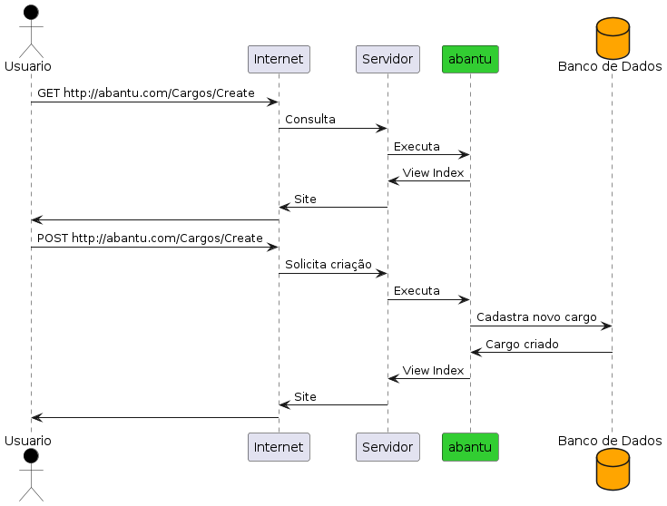

<style>
section {
    justify-content: start;
}

img[alt$="<"] {
    float: left;
    margin-right: 2em;
    }

img[alt$="center"] {
    display: block;
    margin: 0 auto;
    }
</style>

<style scoped>section { justify-content: center; }</style>

# Educafro Tech
## Curso C# - Do Básico ao MVC
### Aula 14
---
# Agenda
1. Introdução à Programação e Ambiente de Desenvolvimento
2. Fundamentos da Programação em C#
3. Programação Orientada a Objetos (POO)
4. Desenvolvimento Web com ASP.NET MVC
5. Banco de Dados e Entity Framework
6. **Construção de um Aplicativo Web MVC**
7. Implementando Recursos Avançados
8. Melhores Práticas e Testes
9. Projetos e Aplicações Futuras

---
<style scoped>section { justify-content: center; }</style>

### 6. Construção de um Aplicativo Web MVC
#### Desenvolvendo a lógica de negócio

---

#### Aumentar Salário

Agora vamos construir a função ```AumentarSalario```. Vamos nos lembrar:

>3. Aumento: Um funcionário só pode receber um aumento se a média das suas avaliações for maior que 7.

Vamos lá. Tente construir o conteúdo dessa função.

---

#### Aumentar Salário

Ela deve ter ficado assim:

```csharp
public Funcionario AumentarSalario(Funcionario funcionario, decimal novoSalario)
{
    var mediaMinima = 7;

    var funcionarioDb = _db.Funcionarios.Single(f => f.Id == funcionario.Id);

    if (funcionarioDb.Avaliacoes == null || funcionarioDb.Avaliacoes.Count == 0)
        throw new ApplicationException("Funcionário não possui avaliações. É necessário uma média superior a 7 para realizar um aumento");

    if (CalcularMediaAvaliacoes(funcionarioDb.Avaliacoes) > mediaMinima)
    {
        funcionarioDb.Salario = novoSalario;

        _db.SaveChanges();
    }

    return funcionarioDb;
}
```

---

#### Aumentar Salário

Agora tente criar o teste dessa função.

Ele deve ficar muito parecido com o teste de demissão.

A variável ```expected``` deve ser o valor do novo salário.

A variável ```actual``` deve ter o salário do funcionário após o ```Gerente``` dar o aumento.

---

#### Aumentar Salário

O teste deve ter ficado assim: 

<font size="2">

```csharp
[Fact]
public void AumentarSalario(){
    var expected = 1372;

    Gerente gerente = _db.Gerentes.First();
    Funcionario funcionario = _db.Funcionarios.First(f => f.Ativo == true);

    Avaliacao avaliacao6 = new Avaliacao();
    avaliacao6.Avaliado = funcionario;
    avaliacao6.Avaliador = gerente;
    avaliacao6.Nota = 6;
    avaliacao6.RealizadaEm = DateTime.Now;
    avaliacao6.Comentario = "Razoável";

    Avaliacao avaliacao9 = new Avaliacao();
    avaliacao9.Avaliado = funcionario;
    avaliacao9.Avaliador = gerente;
    avaliacao9.Nota = 9;
    avaliacao9.RealizadaEm = DateTime.Now;
    avaliacao9.Comentario = "Muito bom!";

    funcionario.Avaliacoes = new List<Avaliacao>();
    funcionario.Avaliacoes.Add(avaliacao6);
    funcionario.Avaliacoes.Add(avaliacao9);

    _db.SaveChanges();

    funcionario = gerente.AumentarSalario(funcionario, expected);

    var actual = funcionario.Salario;

    Assert.Equal(expected, actual);
}
```

</font>

---

#### Validações

Um ponto adicional. Nossa lógica de ```Demitir``` e ```AumentarSalario```, usam um ```if``` para verificar se a média da avaliação do ```Funcionario``` é superior ou inferior aos limites.

Ex.:

```csharp
var funcionarioDb = _db.Funcionarios.Single(f => f.Id == funcionario.Id);

        if (CalcularMediaAvaliacoes(funcionarioDb.Avaliacoes) < mediaMinima)
        {
            funcionarioDb.Ativo = false;

            _db.SaveChanges();
        }

        return funcionarioDb;
```

---

#### Validações

Mas e quando a média não for suficiente?

Como nosso ```if``` não tem um ```else```, nada acontece.

O objeto do tipo ```Funcionario``` vai ser devolvido sem nenhuma alteração.

Como já falamos, talvez esse seja a regra de negócio desejada, mas normalmente esse tipo de situação precisa de uma mensagem que avise o usuário do sistema.

Então podemos melhorar nosso código e colocar a validação da média, junto com a validação se as ```Avaliacoes``` existem.

---

#### Validações

Ou seja, nossos códigos ficam assim:

```csharp
public Funcionario Demitir(Funcionario funcionario)
{
    var mediaMinima = 5;

    var funcionarioDb = _db.Funcionarios.Single(f => f.Id == funcionario.Id);

    if (funcionario.Avaliacoes == null || funcionario.Avaliacoes.Count == 0 || CalcularMediaAvaliacoes(funcionarioDb.Avaliacoes) >= mediaMinima)
        throw new ApplicationException("Funcionário não possui avaliações. É necessário uma média inferior a 5 para realizar uma demissão");

    funcionarioDb.Ativo = false;

    _db.SaveChanges();

    return funcionarioDb;
}
```

⚠️ Importante: Atenção para a mudança do sinal. Antes, era ```<``` (menor), agora é ```>=``` (maior igual). 

---

#### Construindo Views e Controllers

Até o momento, só trabalhamos o **M** do **MVC**. Agora vamos para as outras letras!

Primeiramente, vamos instalar uma ferramenta que nos ajuda muito nesse processo!

O ```dotnet aspnet-codegenerator```.

Para instalar, no **Terminal**, acesse o diretório do projeto **MVC**:

```
cd ../abantu.mvc/
```

Depois:

```
dotnet tool install -g dotnet-aspnet-codegenerator --version 6.0.16
```

---

#### Construindo Views e Controllers

Precisamos também instalar essa biblioteca no projeto:

```
dotnet add package Microsoft.EntityFrameworkCore.Design --version 6.0.29
dotnet add package Microsoft.EntityFrameworkCore.SQLite --version 6.0.29
dotnet add package Microsoft.VisualStudio.Web.CodeGeneration.Design --version 6.0.16
dotnet add package Microsoft.EntityFrameworkCore.SqlServer --version 6.0.29
dotnet add package Microsoft.EntityFrameworkCore.Tools --version 6.0.29
```

---

#### Construindo Views e Controllers

Agora vamos criar as **Views** e **Controllers** da **Model**: Cargo

Para isso, no terminal, digite:

```
dotnet aspnet-codegenerator controller -name CargosController -m Cargo -dc abantu.mvc.Data.ApplicationDbContext --relativeFolderPath Controllers --useDefaultLayout --referenceScriptLibraries
```

Vamos por partes.

```dotnet``` é nosso comando básico
```aspnet-codegenerator``` é a ferramenta que acabamos de instalar
```controller``` é o **C** do MVC que estamos pedindo para ser criado
```-name``` é o nome do **Controller** que queremos
```-m``` é a partir de qual **Model** que queremos criar o **Controller**
```-dc``` é o contexto de banco de dados que queremos usar

---

#### Construindo Views e Controllers

```--relativeFolderPath``` é a pasta onde o **Controller** deve ser criado
```--useDefaultLayout``` é a orientação para que as telas tenham o layout padrão do projeto
```-referenceScriptLibraries``` é uma funcionalidade para melhorar a performance da aplicação

---

#### Construindo Views e Controllers

O resultado é a criação de uma pasta **Cargos** na pasta **Views** com os arquivos para exibir lista, criar, alterar e excluir ```Cargos```.

Também é criado o arquivo ```CargosController.cs``` na pasta **Controllers**.

Vamos executar nossa aplicação para ver o resultado.

No **Terminal**, digite:

```dotnet run```

---

#### Construindo Views e Controllers

No resultado da execução você vai ver o endereço da sua página no seu computador:

```
info: Microsoft.Hosting.Lifetime[14]
Now listening on: http://localhost:5161
```

Onde nesse caso é http://localhost:5161 mas o número 5161 pode variar.

No navegador acesse esse endereço colocando: /Cargos no final.

Ex.: http://localhost:5161/Cargos

Clique no botão ***Create New*** e experimente criar um novo cargo. Ex.: "Vendedor".

Ele vai ficar salvo no banco de dados. Depois experimente: criar outros cargos, excluir um cargo, alterar um cargo existente. Está tudo pronto e funcionando com um único comando.

---

#### Construindo Views e Controllers

Agora vamos entender melhor o que está acontecendo. Abra o arquivo **CargosController**.

A primeira coisa que encontramos, já vimos antes. Um construtor recebendo o banco de dados por parâmetro.

```csharp
private readonly ApplicationDbContext _context;

    public CargosController(ApplicationDbContext context)
    {
        _context = context;
    }
```

---

#### Construindo Views e Controllers

Depois temos um método: ```Index```. Ele é o método padrão de um **Controller**. Se nenhum parâmetro for fornecido, esse método será executado.

Você consegue ler o que ele faz?

---

#### Construindo Views e Controllers

Está escrito de uma forma diferente, mas basicamente, é feita a consulta de todos os cargos e o resultado é enviando para a **View**.

```csharp
return _context.Cargos != null ? 
    View(await _context.Cargos.ToListAsync()) :
    Problem("Entity set 'ApplicationDbContext.Cargos'  is null.");
```

```_context.Cargos != null ?``` é uma forma curta de escrever: ```if (_context.Cargos != null)``` ou seja, se ```Cargos``` existir, faça tal coisa.

```View(await _context.Cargos.ToListAsync())``` é a tal coisa. Retorne a View de mesmo nome que o método (nesse caso, Index), com a lista de ```Cargos``` como parâmetro.


---

#### Construindo Views e Controllers

```: Problem("Entity set 'ApplicationDbContext.Cargos'  is null.")``` o ```:``` é o ```else``` ou seja, se ```Cargos``` não existir, retorne uma tela de problema informando que ```Cargos is null```.

Agora tente ler o próximo método: ```Details```

---

#### Construindo Views e Controllers

Primeiramente, há um comentário. Essa **View** ```Details``` é acessada pelo endereço:

Cargos/Details/5

Onde Cargos é o **Controller**, **Details** é o método e **5** é o exemplo de parâmetro para a função.

Então basicamente ela vai mostrar os detalhes do ```Cargo``` que tiver o ```Id == 5``` (ou qualquer outro).

Se não for informado um ```Id``` ou se o banco de dados não tiver a tabela ```Cargos```, o usuário vai receber a informação de que o cargo pesquisado não foi encontrado.

O mesmo acontece se o ```Id``` informado não for de nenhum cargo existente.

Se o cargo for encontrado, é retornada a **View** de nome **Details**.

---

#### Construindo Views e Controllers

Depois temos o método **Create**. Ele é super simples, quando o endereço /Cargos/Create for chamado, a **View** de mesmo nome é exibida. Basicamente ela é o formulário para cadastrar novos cargos.

Agora temos um método bem diferente. O ```Create``` com parâmetros é o que vai receber os dados preenchidos no formulário e cadastrar um novo ```Cargo```. Ele começa com um atributo ```[HttpPost]```. E aqui, eu preciso explicar um pouco como funciona a internet.

---

#### Como funciona a internet

Existem muitas tecnologias para criação de sites. A que estamos usando é o .Net MVC. Mas basicamente todas funcionam da mesma forma.



---

#### Como funciona a internet

Quando estamos navegando na internet, estamos usando o protocolo HTTP (**H**yper**T**ext **T**ransfer **P**rotocol). E nesse protocolo, temos 4 verbos, ou 4 tipos de ações que podemos ter:

1. GET: Para consultas
2. POST: Para criação
3. PUT: Para atualização
4. DELETE: Para exclusão

No MVC vamos usar essencialmente o GET e o POST. Mesmo para atualização de uma informação o MVC usa POST, por padrão.

---

#### Construindo Views e Controllers

Voltando ao MVC, no segundo método ```Create``` temos o atributo ```[HttpPost]``` para receber os dados do formulário de criação de um novo ```Cargo```.

Nos parâmetros dessa função temos um outro atributo ```[Bind("Id,Nome,Nivel")] Cargo cargo```. Basicamente esse atributo vai pegar os campos do formulário e criar (```Cargo cargo = new Cargo();```) um objeto do tipo ```Cargo``` com o valor desses campos.

Como nossa **Model** pode ter validações, no começo da função verificamos se todas as validações estão OK. ```if (ModelState.IsValid)```.

Se sim, adicionamos o novo cargo ao contexto de banco de dados e salvamos as alterações no banco de dados. Se tudo certo, enviamos o usuário para a **View** Index ou mantemos ele no formulário para correções.

---

#### Construindo Views e Controllers

Os demais métodos são muito similares ao ```Create```. Tente ler e entender eles.

Duas palavrinhas que eu não expliquei anteriormente e estão nesse **Controller** são:

***async await***

Ex.: ```public async Task<IActionResult> Index()```

Até agora, todo que fizemos foi síncrono. Ou seja, cada linha de código foi executada uma após a outra.

Mas lembre do exercício de fazer um sanduíche. Enquanto estamos derretendo o queijo, podemos muito bem cortar o pão e passar maionese nele. Para fazermos um programa que faz duas coisa ao mesmo tempo, usamos o **paralelismo** ou **programação assíncrona**.

---

#### Construindo Views e Controllers

Isso é muito comum no MVC pois, ao mesmo tempo, vamos ter muitos usuários usando nossa aplicação. Imagine o Instagram ou Whatsapp. Se duas pessoas mandassem uma mensagem, e uma só pudesse ser processada depois da outra, provavelmente ninguém iria gostar da ferramenta porque tudo seria muito lento.

Então, quando você encontrar um método com ```async```, geralmente você vai encontrar um ```await```. Basicamente o computador vai conseguir processar várias chamadas desse método em paralelo, mas na função que tem ```await``` o computador vai aguardar ela finalizar, antes de seguir com as demais instruções.

---

<style scoped>section { justify-content: center; }</style>

# Muito obrigado
## E nos vemos na próxima aula! 👋


