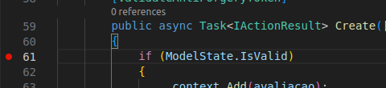
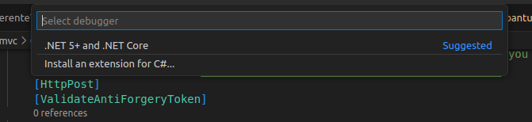
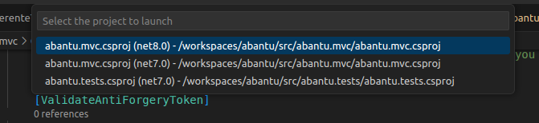

<style>
section {
    justify-content: start;
}

img[alt$="<"] {
    float: left;
    margin-right: 2em;
    }

img[alt$="center"] {
    display: block;
    margin: 0 auto;
    }
</style>

<style scoped>section { justify-content: center; }</style>

# Educafro Tech
## Curso C# - Do Básico ao MVC
### Aula 15
---
# Agenda
1. Introdução à Programação e Ambiente de Desenvolvimento
2. Fundamentos da Programação em C#
3. Programação Orientada a Objetos (POO)
4. Desenvolvimento Web com ASP.NET MVC
5. Banco de Dados e Entity Framework
6. **Construção de um Aplicativo Web MVC**
7. Implementando Recursos Avançados
8. Melhores Práticas e Testes
9. Projetos e Aplicações Futuras

---
<style scoped>section { justify-content: center; }</style>

### 6. Construção de um Aplicativo Web MVC
#### Construindo Views e Controllers

---

#### Construindo Views e Controllers

Vamos criar nossas outras **Views** e **Controllers**.

Tente executar o ```dotnet aspnet-codegenerator``` para a **Model** ```Avaliacao```.

---

#### Construindo Views e Controllers

Seu comando deve ter ficado assim:

```
dotnet aspnet-codegenerator controller -name AvaliacoesController -m Avaliacao -dc abantu.mvc.Data.ApplicationDbContext --relativeFolderPath Controllers --useDefaultLayout --referenceScriptLibraries
```

Agora execute o projeto com:

```dotnet run```

Acesse a página de criação de uma avaliação:

http://localhost:5161/Avaliacoes/Create

Lembrando que o número 5161 pode ser diferente no seu computador.

Tente criar uma avaliação. Não deveria funcionar, mas não há informações do por quê, certo?

---

#### Debug

Um recurso muito utilizado no desenvolvimento é o **Debug**. Esse é o processo para analisar e retirar ***bugs*** (erros) de um sistema.

Clique no ```AvaliacoesController``` e clique antes do número da linha com o código: ```if (ModelState.IsValid)```.

Vai aparecer um ponto vermelho que indica que um ***breakpoint*** foi adicionado.



Isso significa que, ao executar a aplicação em modo ***Debug***, a execução do código vai parar nesse ponto e você poderá analisar tudo que está acontecendo.

---

#### Debug

Para executar nosso projeto no modo ***Debug***, tecle F5.

Na primeira vez, será necessário configurar o projeto.

No topo da tela aparecerá a pergunta sobre qual ***debugger*** você deseja utilizar. No nosso caso vamos escolher o .Net 5+.



---

#### Debug

Depois será perguntado qual projeto você deseja debugar.



Escolha o projeto **MVC**.

Depois disso, basta teclar F5 novamente e seu projeto será executado no modo **Debug**.

Acesse novamente http://localhost:5161/Avaliacoes/Create

E veja que, ao enviar, o Visual Studio Code vai estar parado na linha com ***breakpoint***.

---

#### Debug

Após analisarmos o ```ModelState```, observamos ele possui 5 itens. Que são as 5 propriedades da nossa **model** ```Avaliacao```. E que dessas, 2 estão com erro.

Analisando ainda mais, observamos que ```ModelState``` tem uma propriedade ```Values``` e que no ```ResultView``` dessa propriedade temos 5 itens. Um para cada propriedade da **model**. Ao navegar por cada um desses itens vimos que a propriedade ```Errors``` possui valores para ```Avaliador``` e ```Avaliado```. E realmente não preenchemos essas informações no formulário de criação da ```Avaliacao```.

---

#### View

Apesar do ```aspnet-codegenerator``` fazer muita coisa para gente ele esqueceu de algo.

Abra o arquivo ```Create.cshtml``` ma pasta **Views\Avaliacoes**.

O que você está vendo é um código em **HTML**. Essa é uma linguagem extremamente popular e é a base de como a internet funciona. Todo site, independentemente da tecnologia, gera um **HTML** para o usuário.

Se quisar saber um pouco mais sobre: https://www.youtube.com/watch?v=3oSIqIqzN3M

---

#### View

Agora vamos incluir um componente nessa página.

```@Html.ValidationSummary()```

O **MVC** possui alguns alguns auxiliares para que você não tenha que se preocupar com o HTML.

Esse componente vai listar todas as validações em tela para o usuário.

```html
<h1>Create</h1>

<h4>Avaliacao</h4>
@Html.ValidationSummary()
<hr />
<div class="row">
```

---

#### View

Experimente realizar a operação novamente.

Agora você vai receber a mensagem:

> The Avaliado field is required. 
The Avaliador field is required.

Infelizmente, o ```aspnet-codegenerator``` gera os textos em inglês. E para essas duas propriedades que são classes que nós criamos, ```Funcionario```, ele não sabe o que fazer exatamente.

Então, vamos nós fazer esse processo!

---

#### View

Vamos no ```AvaliacoesController``` e no método ```Create```.

1. Precisamos consultar todos os ```Funcionarios```
2. Precisamos consultar todos os ```Gerentes```
3. Transformar esses dados em uma lista de ```SelectListItem```
3. Enviar esses dados para a **View** usando um novo objeto. O ```ViewBag```.


---

#### View

O item 3 fica assim:

```csharp
private List<SelectListItem> FuncionariosParaLista(List<Funcionario> funcionarios)
{
    List<SelectListItem> itens = new List<SelectListItem>();

    foreach (var item in funcionarios)
    {
        itens.Add(new SelectListItem
        {
            Text = item.Nome,
            Value = item.Id.ToString()
        });
    }

    return itens;
}
```

---

#### View

Aqui temos algumas novidades:

```foreach``` é muito similar ao for, mas com uma praticidade para pegar cada item da lista como um objeto na variável ```item```, mas poderia ser qualquer nome.

Agora, na hora de adicionar um item na lista, criamos um novo objeto do tipo ```SelectListItem``` com ```{ }```. Isso é muito útil para reduzir digitação.

A forma extensa seria:

```csharp
var listItem = new SelectListItem;
listItem.Text = item.Nome;
listItem.Value = item.Id.ToString();
itens.Add(item);
```

---

#### View

Agora para o item 4, precisamos fazer uma conversão da lista de ```Gerentes``` em uma lista de ```Funcionarios```. Isso é possível pois a primeira é filha da segunda.

Para isso, você deve ter selecionado os gerentes assim:

```csharp
var gerentes = _context.Gerentes.ToList();
```

Então vamos adicionar a função LINQ ```Select``` para definir o que, dos gerentes, nós queremos. Poderia ser somente uma ou duas propriedades ou somar dois campos.

No nosso caso, fica assim:

```csharp
var gerentes = _context.Gerentes.Select(g => (Funcionario)g).ToList();
```

---

#### View

Quando você coloca uma classe entre parênteses antes de um objeto, o C# converte um objeto de um tipo em outro, desde que eles seja da mesma família.

O item 4 fica assim:

```csharp
// GET: Avaliacoes/Create
public IActionResult Create()
{
    var funcionarios = _context.Funcionarios.ToList();
    var gerentes = _context.Gerentes.Select(g => (Funcionario)g).ToList();

    ViewBag.Funcionarios = FuncionariosParaLista(funcionarios);
    ViewBag.Gerentes = FuncionariosParaLista(gerentes);

    return View();
}
```

---

#### View

Agora na **View**, vamos adicionar os componentes que vão exibir nossa lista de funcionários e gerentes:

```html
<form asp-action="Create">
    <div asp-validation-summary="ModelOnly" class="text-danger"></div>
    <div class="form-group">
        Avaliado : @Html.DropDownList("Funcionarios")
    </div>
    <div class="form-group">
        Avaliador : @Html.DropDownList("Gerentes")
    </div>
```

Tente executar novamente, e cadastrar uma avaliação.

Ainda não é possível pois não temos gerentes nem funcionários cadastrados.

---

<style scoped>section { justify-content: center; }</style>

# Muito obrigado
## E nos vemos na próxima aula! 👋


