<style>
section {
    justify-content: start;
}

img[alt$="<"] {
    float: left;
    margin-right: 2em;
    }

img[alt$="center"] {
    display: block;
    margin: 0 auto;
    }
</style>

<style scoped>section { justify-content: center; }</style>

# Educafro Tech
## Curso C# - Do Básico ao MVC
### Aula 3
---
# Agenda
1. Introdução à Programação e Ambiente de Desenvolvimento
2. **Fundamentos da Programação em C#**
3. Programação Orientada a Objetos (POO)
4. Desenvolvimento Web com ASP.NET MVC
5. Banco de Dados SQL Server e Entity Framework
6. Construção de um Aplicativo Web MVC
7. Implementando Recursos Avançados
8. Melhores Práticas e Testes
9. Projetos e Aplicações Futuras

---
<style scoped>section { justify-content: center; }</style>

### 2. Fundamentos da Programação em C#
#### Criando uma aplicação .Net em C#

---

#### Criando um novo repositório

Agora que temos tudo pronto, vamos começar no GitHub.

Acesse: https://github.com com seu usuário e senha.

No lado esquerdo, clique em **New**, para criar um novo repositório.

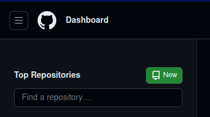

---

#### Criando um novo repositório

Agora escolha um nome para o repositório.

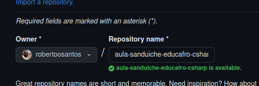

No meu caso eu escolhi: ```aula-sanduiche-educafro-csharp```

---

#### Criando um novo repositório

Existem duas opções para um repositório:

***Public*** (ou público, em português) significa que qualquer pessoa com acesso a internet terá acesso aos seus códigos

***Private*** (ou privado, em português) você pode definir quem terá acesso aos seus códigos

Para o conteúdo da nossa aula, utilizaremos sempre a opção ***Public***.

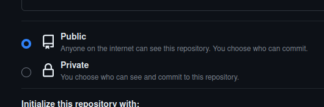

---

#### Criando um novo repositório

Selecione a opção:

***Add a README file*** (do inglês *read me file*. Ou seja, arquivo Leia-me) Todo programa de computador é um exercício de criatividade. ⚠️ Sempre faça algum tipo de documentação ⚠️ 

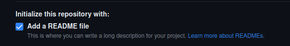

---

#### Criando um novo repositório

Selecione a opção:

**Visual Studio** em ***Add .gitignore***


Por trás do **Git**Hub existe uma tecnologia que se chama Git. Ela tem a função de controlar as mudanças que são feitas nos programas de um repositório.

Mas alguns arquivos não precisam desse controle. O nome desses arquivos colocamos no arquivo **.gitignore**

---

#### Criando um novo repositório

Por último, selecione:

**GNU General Public License v3.0** em ***Choose a license***

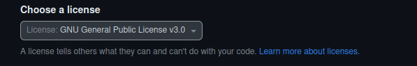

Existe um mundo de conhecimento relacionado a licenças de software, mas basicamente a GPLv3 dá liberdade, mas também algum controle.

---

#### Criando um novo repositório

##### 🎈🎈🎈PARABÉNS!🎈🎈🎈 Você criou seu primeiro repositório de código C#!

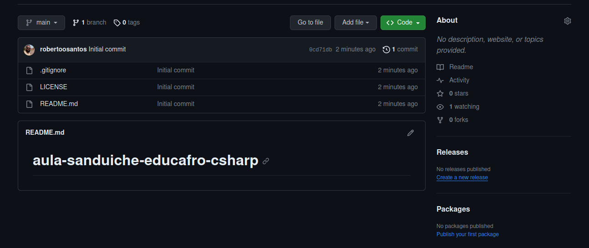


---

#### Criando um novo repositório

Agora que você tem um repositório criado, vamos começar a desenvolver nossa primeira aplicação em C#.

Até agora, tudo que você fez está apenas na internet. Vamos começar copiando este repositório para o seu computador.


---

#### Clonando um repositório

No canto superior direito clique em **<> Code**

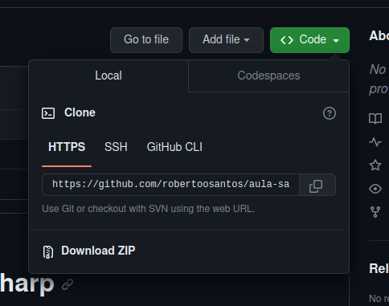

Copie o endereço HTTPS do seu repositório clicando em: 


---

#### Clonando um repositório

Abra o Visual Studio Code.

Do lado esquerdo, toque em 

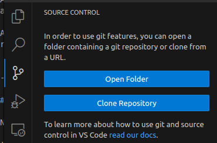


---

#### Clonando um repositório

Clique no botão ***Clone Repository***


Clique em ***Clone from GitHub***

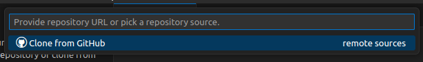

Clique no repositório que você criou no começo dessa aula

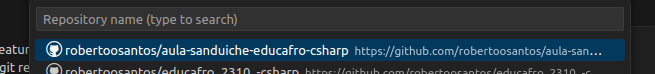


---

#### Clonando um repositório

Agora, escolha uma pasta do seu computador para o seu repositório.

> Eu sugiro, Documentos/Projetos

O Visual Studio Code irá perguntar se você quer abrir o repositório.

Escolha ***Open*** ou ***Abrir***.

---


#### Criando uma Console Application

A base de todo programa C# é um projeto.

Para criar um projeto, no Visual Studio Code clique em **Terminal** > **New Terminal** ou **Novo Terminal**.

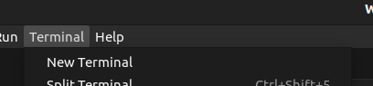

---

#### Criando uma Console Application

No terminal, digite ```dotnet```

```console
$ dotnet

Usage: dotnet [options]
Usage: dotnet [path-to-application]

Options:
  -h|--help         Display help.
  --info            Display .NET information.
  --list-sdks       Display the installed SDKs.
  --list-runtimes   Display the installed runtimes.

path-to-application:
  The path to an application .dll file to execute.
```

---

#### Criando uma Console Application

Note a opção ```-h|--help```. Essa opção mostra uma ajuda do comando ```dotnet```.

Agora vamos experimentar ```dotnet -h``` ou ```dotnet --help```

Escreva uma das opções no terminal e tecle **Enter**

Veja que a primeira opção é:

```new               Create a new .NET project or file.```

Ou seja, digitar ```dotnet new``` vai criar um novo projeto .Net no seu repositório

---

#### Criando uma Solução

Veja que ao digitar ```dotnet new``` e apertar a tecla **Enter** são exibidas mais algumas informações:

```
The 'dotnet new' command creates a .NET project based on a template.

Common templates are:
Template Name         Short Name    Language    Tags               
--------------------  ------------  ----------  -------------------
ASP.NET Core Web App  webapp,razor  [C#]        Web/MVC/Razor Pages
Blazor Server App     blazorserver  [C#]        Web/Blazor         
Class Library         classlib      [C#],F#,VB  Common/Library     
Console App           console       [C#],F#,VB  Common/Console     

An example would be:
   dotnet new console
```

---

#### Criando uma Solução

Esses são alguns exemplos de projetos que você pode fazer em .Net.

Vamos usar o ```dotnet new solution``` para criar uma solução .Net.

Veja que foi criado 1 arquivos no seu repositório. No lado esquerdo clique em: 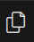

E veja os arquivos marcados com **U**

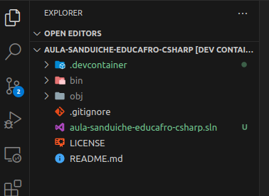

---

#### Criando uma Console Application

De volta ao terminal, vamos usar o ```dotnet new console -o Sanduiche --use-program-main``` uma das opções mais simples de projeto em .Net com a linguagem C#.

```dotnet``` é a tecnologia que estamos usando. Ou seja, .Net.
```new``` quer dizer novo. Pois estamos criando algo novo no repositório.
```console``` é o tipo de projeto que estamos criando.
```-o``` é um parâmetro que define o local de saída (***o**utput*) do projeto.
```Sanduiche``` é o valor do parâmetro ```-o```, ou seja, a saída será na pasta "Sanduiche" (sem acento agudo)
```--use-program-main``` a partir da versão 6 do .Net, projetos do tipo console possuem uma versão simplificada, mas para efeito dessa aula, precisamos do modelo antigo de projetos *console application*.

---

#### Criando uma Console Application

Veja que foram criados uma pasta com o nome "Sanduiche" e 2 arquivos nesta pasta.

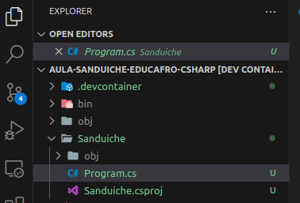

---

#### Criando uma Console Application

O arquivo que termina com ```.csproj``` é o arquivo do **proj**eto **C** **S**harp

O arquivo ```Program.cs``` é o programa base do projeto. Clique duas vezes nele.

Ele é um arquivo bastante simples com apenas uma função C#.

```c#
namespace Sanduiche;

public class Program
{
    public static void Main(string[] args)
    {
        Console.WriteLine("Hello, World!");
    }
}
```

---


#### Uma Classe!!

Vamos examinar cada uma das linhas do arquivo.

```c#
namespace Sanduiche;
```
É uma organização para seus códigos
```c#
public class Program
```
É uma classe pública para o programa principal do projeto
```c#
    public static void Main(string[] args)
```
É uma função, pública e estática. É a função principal desse programa.

---

#### Executando um programa C#

```c#
        Console.WriteLine("Hello, World!");
```
É uma função que escreve *Hello, World!* no console..

Vamos executar esse programa.

Vamos adicionar o projeto na solução, execute, no terminal, o comando ```dotnet sln add ./Sanduiche/Sanduiche.csproj``` e tecle **Enter**

Depois, digite ```dotnet run --project ./Sanduiche``` e tecle **Enter**

```
dotnet run --project ./Sanduiche

Hello, World!
```

---

#### Vamos fazer um sanduíche!

Agora vamos experimentar fazer o exercício de fazer um sanduíche de mortadela com queijo!

Como falei, uma das melhores maneiras de desenvolver um programa é testar cada função individualmente.

Geralmente, se cada função faz aquilo que você espera, basta uni-las em uma ordem lógica para resolver o problema que se tem.

Para ajudar nesse processo, diversas tecnologias permitem criar um projeto de testes. .Net não é diferente.

---

#### Criando um projeto de testes

Para criar um projeto de testes, vamos usar novamente o comando ```dotnet new``` mas agora, com a biblioteca de testes ```xunit```.

> Existem outras bibliotecas de testes em .Net mas esta é a que eu mais utilizo.

Vamos executar o comando ```dotnet new xunit -o Sanduiche.Test```

Veja que foram criados uma pasta com o nome Sanduiche.Test e alguns arquivos no seu repositório.

Vamos adicionar o projeto de testes à solução com o comando ```dotnet sln add```

Execute: ```dotnet sln add ./Sanduiche.Test/Sanduiche.Test.csproj```

---

#### Fazendo um *commit*

##### ⚠️ Faça *commit* frequentemente ⚠️

Mas o que é *commit*?
*Commit* significa registrar o trabalho que você produziu até um determinado momento.

Para fazer um *commit* vá no Source Control 

Escreva uma mensagem para o trabalho que produziu.

Nesse caso vou utilizar: "Solução inicial"

E clique no botão ***Commit***


---

#### Fazendo um *commit*

Uma mensagem vai ser exibida informando que você não marcou nenhum arquivo em específico para o *commit* então, todos os arquivos serão registrados.

Nesse caso, selecione **Sim** ou ***Yes***

Agora o botão que estava escrito ***Commit*** agora está escrito ***Sync Changes*** ou seja, sincronizar mudanças.

Clique nesse botão.

Uma mensagem informando que as mudanças serão enviadas e baixadas do seu repositório GitHub da internet, será exibida.

Selecione **OK**


---

#### Continuando nosso programa

Agora, no projeto de testes, vamos renomear o arquivo clicando nele e apertando a tecla **F2** ```UnitTest1.cs``` para ```ProgramTest.cs```. Para deixar claro que esse arquivo vai testar o Programa base do nosso projeto.

Clique duas vezes nesse arquivo para abrir.


---

#### Uma classe

Note que esse arquivo é muito parecido com o ```Program.cs```

```c#
namespace Sanduiche.Test;

public class UnitTest1
{
    [Fact]
    public void Test1()
    {

    }
}
```

---

#### Uma classe

```c#
namespace Sanduiche.Test;
```
Enquanto o ```Program.cs``` está no ```Sanduiche```, o teste está em ```Sanduiche.Test```

```c#
public class UnitTest1
```
Essa classe se chama UnitTest1
```c#
    [Fact]
```
Indica que estamos testando um fato.
```c#
    public void Test1()
```
É a nossa função de testes

---

#### Ajustando o teste

Mude o nome da classe ```UnitTest1``` para ```ProgramTest```.

Mude o nome da função de ```Test1``` para ```MainTest```.

Isso significa que vamos testar a função principal do program do nosso projeto.

Vamos adicionar uma referência do projeto principal ao projeto de testes com o comando:

```
dotnet add ./Sanduiche.Test/Sanduiche.Test.csproj reference ./Sanduiche/Sanduiche.csproj
```

---


#### Atenção

Antes de continuar, confirme que na barra inferior do Visual Studio Code, aparece a informação: "Projects: 2".


Se não estiver, vai ser necessário fechar e abrir o Visual Studio Code.

---

#### Ajustando o teste

Vamos mudar a função ```MainTest``` com o seguinte conteúdo

```c#
/// expected é o valor esperado ao executar o programa
string expected = "Sanduíche de Mortadela com Queijo está pronto!\n";
/// StringWriter tem a função de armazenar a saída do nosso programa
using (StringWriter saida = new StringWriter())
{
    /// Aqui definimos que a saída do console será nosso StringWriter
    Console.SetOut(saida);
    /// Simulamos a chamada do nosso programa
    Sanduiche.Program.Main(null);
    /// Testamos se a saída do programa é a que esperamos
    Assert.EndsWith(expected, saida.ToString());
}
```

---

#### Ajustando o teste

Tem muita coisa nesse código, mas eu vou explicar com calma em aulas futuras.

Aqui é importante entender que:

1. Variáveis são utilizadas para armazenar valores (textos, datas, números...)
2. Variáveis ocupam espaço na memória e, algumas vezes outros recursos
3. Em ```Sanduiche.Program.Main(null)``` usamos o *namespace*, o nome da classe e o nome da função
4. Em C# maiúsculas e minúsculas fazem diferença
5. Ao final de cada instrução é necessário um ;
6. Algumas funções como o *using* não precisam de ; mas de { }

---


