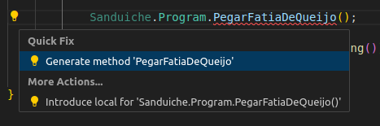

<style>
section {
    justify-content: start;
}

img[alt$="<"] {
    float: left;
    margin-right: 2em;
    }

img[alt$="center"] {
    display: block;
    margin: 0 auto;
    }
</style>

<style scoped>section { justify-content: center; }</style>

# Educafro Tech
## Curso C# - Do Básico ao MVC
### Aula 4
---
# Agenda
1. Introdução à Programação e Ambiente de Desenvolvimento
2. **Fundamentos da Programação em C#**
3. Programação Orientada a Objetos (POO)
4. Desenvolvimento Web com ASP.NET MVC
5. Banco de Dados e Entity Framework
6. Construção de um Aplicativo Web MVC
7. Implementando Recursos Avançados
8. Melhores Práticas e Testes
9. Projetos e Aplicações Futuras

---
<style scoped>section { justify-content: center; }</style>

### 2. Fundamentos da Programação em C#
#### Criando uma aplicação .Net em C#


---

#### Agora sim!

Vamos fazer o teste da função ```PegarFatiaDeQueijo```. A mensagem: "Peguei uma fatia de queijo.".

```c#
[Fact]
    public void PegarFatiaDeQueijoTest()
    {
        string expectedQueijo = "Peguei uma fatia de queijo.";

        string actualQueijo = Sanduiche.Program.PegarFatiaDeQueijo();

        Assert.Equal(expectedQueijo, actualQueijo);
    }
```

---

#### Agora não!

Veja que novamente nossos testes falharam.

```
error CS0117: 'Program' does not contain a definition for 'PegarFatiaDeQueijo' [/workspaces/aula-sanduiche-educafro-csharp/Sanduiche.Test/Sanduiche.Test.csproj]
```

Mas é claro! Ainda não criamos a função ```PegarFatiaDeQueijo```.

Por sorte, o Visual Studio Code e suas extensões nos ajudam.

Clique no nome da função e tecle CTRL + . ou clique na lampada no lado esquerdo do código



---

#### Gerando a função PegarFatiaDeQueijo


Clique na primeira opção. Ela vai gerar o a função ```PegarFatiaDeQueijo``` para você!

Veja que o arquivo Program.cs é aberto e uma bola branca ao lado do nome indica que ele foi alterado, mas a alteração não foi salva 

Clique no arquivo e veja a alteração.

---

#### Gerando a função PegarFatiaDeQueijo

```c#
    public static string PegarFatiaDeQueijo()
    {
        throw new NotImplementedException();
    }
```

Observe também que ao salvar o arquivo, seus testes rodam novamente e temos um novo resultado.

```console
Sanduiche.Test.ProgramTest.PegarFatiaDeQueijoTest [FAIL]
  Failed Sanduiche.Test.ProgramTest.PegarFatiaDeQueijoTest [< 1 ms]
  Error Message:
   System.NotImplementedException : The method or operation is not implemented.
```

A função ```throw new NotImplementedException();``` faz exatamente isso. Ela dispara um erro indicando que esta função ainda não foi desenvolvida.

---

#### Vamos resolver isso!

Agora vamos alterar o código da função ```PegarFatiaDeQueijo``` com o seguinte conteúdo:

```c#
    public static string PegarFatiaDeQueijo()
    {
        return "Peguei uma fatia de queijo.";
    }
```

Note que a função tem uma diferença em relação à função ```Main```.

```csharp
/// Main:
public static void Main()
/// PegarFatiaDeQueijo:
public static string PegarFatiaDeQueijo()
```

---

#### Tipos de função

Antes do nome da função, temos as palavras ```void``` e ```string```. Estes são os tipos das funções. A função ```Main``` é do tipo ```void``` que significa **vazio** ou seja, ela não tem um resultado. Já a função ```PegarFatiaDeQueijo``` é do tipo ```string``` ou seja, ela precisa retornar um texto.

Por isso a linha:

```csharp
return "Peguei uma fatia de queijo.";
```

Ao salvar nossas alterações, novamente temos nossos testes executados com sucesso!

```console
Starting test execution, please wait...
A total of 1 test files matched the specified pattern.

Passed!  - Failed:     0, Passed:     2, Skipped:     0, Total:     2, Duration: 3 ms - Sanduiche.Test.dll (net7.0)
```

---

#### Agora é a sua vez!

Crie um teste para a função ```PegarFatiaDeMortadela```

---


#### Excelente!!!

##### ⚠️ Faça um novo commit

Sua função de testes deve ter ficado muito parecida com a ```PegarFatiaDeQueijoTest```

E novamente você deve estar vendo o erro no terminal:

```'Program' does not contain a definition for 'PegarFatiaDeMortadela'```

---

#### Agora é a sua vez!

Crie a função ```PegarFatiaDeMortadela```

---

#### Mas e o DRY?

Compare as duas funções ```PegarFatiaDeQueijo``` e ```PegarFatiaDeMortadela```.

Elas são praticamente idênticas.

Como falamos, é possível transformar essas duas funções numa única, e através de parâmetros informar o que queremos pegar.

---


#### Funções com parâmetros

Mude a chamada da função ```PegarFatiaDeMortadela``` para:

```c#
string actual = Sanduiche.Program.PegarFatia("mortadela");
```

Ou seja, ```"mortadela"``` é um parâmetro da função ```PegarFatia```

Ao salvar o arquivo, novamente nossos testes vão dizer:

```console
'Program' does not contain a definition for 'PegarFatia'
```


---

#### Funções com parâmetros

Observe que agora o teste ```PegarFatiaDeMortadela``` espera que a mensagem ```Peguei uma fatia de mortadela.``` seja o retorno da função quando o parâmetro for ```"mortadela"```. Mas e quando for ```"queijo"```?

Vamos mudar o teste ```PegarFatiaDeQueijoTest```.

```c#
string actual = Sanduiche.Program.PegarFatia("queijo");
```

---

#### Funções com parâmetros

Use novamente o ***Quick Fix*** (```CTRL+.```), para criar a função ```PegarFatia```.

Mude o nome do parâmetro para: ```string ingrediente```.

Ou seja, ```string ingrediente"``` indicam que a função aceita um parâmetro e seu tipo é ```string```, que significa, texto e que seu nome é ingrediente.

---

#### Funções com parâmetros

A versão final fica assim:

```c#
    public static string PegarFatia(string ingrediente)
    {
        return string.Format("Peguei uma fatia de {0}.", ingrediente);
    }
```

Note que o retorno da função é o resultado de uma outra função. ```string.Format``` é uma função que toda ```string``` tem. Ele recebe um parâmetro do tipo ```string``` que contém um texto com números entre chaves, ```{0}```, para indicar que aquele lugar tem que ser substituído com o valor da variável que está no próximo parâmetro da função.

---

#### Função com parâmetros

Então no final, temos uma única função que consegue pegar uma fatia de qualquer coisa.

Salve o arquivo e veja seus testes executarem novamente, mas agora, com sucesso!

```console
A total of 1 test files matched the specified pattern.

Passed!  - Failed:     0, Passed:     3, Skipped:     0, Total:     3, Duration: 4 ms
```

##### ⚠️ Faça um novo commit

---

<style scoped>section { justify-content: center; }</style>

# Muito obrigado
## E nos vemos na próxima aula! 👋


