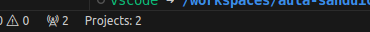

<style>
section {
    justify-content: start;
}

img[alt$="<"] {
    float: left;
    margin-right: 2em;
    }

img[alt$="center"] {
    display: block;
    margin: 0 auto;
    }
</style>

<style scoped>section { justify-content: center; }</style>

# Educafro Tech
## Curso C# - Do Básico ao MVC
### Aula 3
---
# Agenda
1. Introdução à Programação e Ambiente de Desenvolvimento
2. **Fundamentos da Programação em C#**
3. Programação Orientada a Objetos (POO)
4. Desenvolvimento Web com ASP.NET MVC
5. Banco de Dados SQL Server e Entity Framework
6. Construção de um Aplicativo Web MVC
7. Implementando Recursos Avançados
8. Melhores Práticas e Testes
9. Projetos e Aplicações Futuras

---
<style scoped>section { justify-content: center; }</style>

### 1. Introdução à Programação e Ambiente de Desenvolvimento
#### Criando uma aplicação .Net em C#

---

#### Continuando nosso programa

Agora, no projeto de testes, vamos renomear o arquivo clicando nele e apertando a tecla **F2** ```UnitTest1.cs``` para ```ProgramTest.cs```. Para deixar claro que esse arquivo vai testar o Programa base do nosso projeto.

Clique duas vezes nesse arquivo para abrir.


---

#### Uma classe

Note que esse arquivo é muito parecido com o ```Program.cs```

```c#
namespace Sanduiche.Test;

public class UnitTest1
{
    [Fact]
    public void Test1()
    {

    }
}
```

---

#### Uma classe

```c#
namespace Sanduiche.Test;
```
Enquanto o ```Program.cs``` está no ```Sanduiche```, o teste está em ```Sanduiche.Test```

```c#
public class UnitTest1
```
Essa classe se chama UnitTest1
```c#
    [Fact]
```
Indica que estamos testando um fato.
```c#
    public void Test1()
```
É a nossa função de testes

---

#### Ajustando o teste

Mude o nome da classe ```UnitTest1``` para ```ProgramTest```.

Mude o nome da função de ```Test1``` para ```MainTest```.

Isso significa que vamos testar a função principal do program do nosso projeto.

Vamos adicionar uma referência do projeto principal ao projeto de testes com o comando:

```
dotnet add ./Sanduiche.Test/Sanduiche.Test.csproj reference ./Sanduiche/Sanduiche.csproj
```

---


#### Atenção

Antes de continuar, confirme que na barra inferior do Visual Studio Code, aparece a informação: "Projects: 2".



Se não estiver, vai ser necessário fechar e abrir o Visual Studio Code.

---

#### Ajustando o teste

Vamos mudar a função ```MainTest``` com o seguinte conteúdo

```c#
/// expected é o valor esperado ao executar o programa
var expected = "Sanduíche de Mortadela com Queijo está pronto!\n";
/// A função Main do nosso programa recebe um parâmetro chamado args
/// Aqui criamos um variável para simular o valor desse parâmetro
string[] args = { };
/// StringWriter tem a função de armazenar a saída do nosso programa
using (var saida = new StringWriter())
{
    /// Aqui definimos que a saída do console será nosso StringWriter
    Console.SetOut(saida);
    /// Simulamos a chamada do nosso programa
    Sanduiche.Program.Main(args);
    /// Testamos se a saída do programa é a que esperamos
    Assert.EndsWith(expected, saida.ToString());
}
```

---

#### Ajustando o teste

Tem muita coisa nesse código, mas eu vou explicar com calma em aulas futuras.

Aqui é importante entender que:

1. Variáveis são utilizadas para armazenar valores (textos, datas, números...)
2. Variáveis ocupam espaço na memória e, algumas vezes outros recursos
3. Em ```Sanduiche.Program.Main(args)``` usamos o *namespace*, o nome da classe e o nome da função
4. Em C# maiúsculas e minúsculas fazem diferença
5. Ao final de cada instrução é necessário um ;
6. Algumas funções como o *using* não precisam de ; mas de { }

---

#### Executando um teste

##### ⚠️ Faça um novo commit
Você pode usar o comentário "Versão inicial dos testes"

Para executar um teste, execute o comando ```dotnet test```

O resultado deve ser parecido com:

```console
[xUnit.net 00:00:00.68]     Sanduiche.Test.ProgramTest.MainTest [FAIL]
  Failed Sanduiche.Test.ProgramTest.MainTest [3 ms]
  Error Message:
   Assert.EndsWith() Failure:
Expected: Sanduíche de Mortadela com Queijo está pronto!

Actual:   Hello, World!

  Stack Trace:
     at Sanduiche.Test.ProgramTest.MainTest() in /workspaces/aula-sanduiche-educafro-csharp/Sanduiche.Test/ProgramTest.cs:line 28
   at System.RuntimeMethodHandle.InvokeMethod(Object target, Void** arguments, Signature sig, Boolean isConstructor)
   at System.Reflection.MethodInvoker.Invoke(Object obj, IntPtr* args, BindingFlags invokeAttr)

Failed!  - Failed:     1, Passed:     0, Skipped:     0, Total:     1, Duration: < 1 ms - Sanduiche.Test.dll (net7.0)
```

---

#### Executando um teste

Ao final, temos o resumo. Nosso teste falhou (*Failed*). 1 teste falhou, 0 tiveram sucesso e 0 foram ignorados. Nosso total de testes é 1.

```console
Failed!  - Failed:     1, Passed:     0, Skipped:     0, Total:     1, Duration: < 1 ms - Sanduiche.Test.dll (net7.0)
```

Um pouco mais pra cima temos a explicação da falha.

```console
  Failed Sanduiche.Test.ProgramTest.MainTest [3 ms]
  Error Message:
   Assert.EndsWith() Failure:
Expected: Sanduíche de Mortadela com Queijo está pronto!

Actual:   Hello, World!
```

---

#### Executando um teste

Imagine que seu chefe, ou cliente pediu para que, quando o sanduíche estivesse pronto, fosse exibida a mensagem (*Expected*) "Sanduíche de Mortadela com Queijo está pronto!", você fez o teste para garantir esse resultado, mas nesse caso, foi exibida a mensagem (*Actual*) "Hello, World!".

Apesar do teste ter falhado, isso foi bom. Garantimos que não vamos entregar um programa que faz o que não deveria!


---

#### Desenvolvendo a função Main

Vamos corrigir isso!

Para que os testes continuem sempre rodando e te ajudando a verificar se você está desenvolvendo corretamente, utilize os seguintes comandos no terminal:

```
cd Sanduiche.Test/
dotnet watch test
```

O ```dotnet watch``` fica monitorando nossos arquivos e sempre que tem uma alteração, ele executa o comando seguinte. No nosso caso, ```test```.


---


#### Desenvolvendo a função Main

Vamos mudar o código da função Main. Para ir até ela, você pode utilizar o Explorer, abrir o arquivo ```Program.cs``` ou no seu teste, clicar na palavra ```Main``` em ```Sanduiche.Program.Main(args)``` e teclar **F12**

A função Main deve ficar assim:

```c#
        Console.WriteLine("Sanduíche pronto!");
```

Salve o arquivo teclando **CTRL+S** e veja que seus testes são executados novamente.

---

#### Oxi! Falhou de novo

Veja que mesmo com a alteração, seu teste falhou.

```console
  Failed Sanduiche.Test.ProgramTest.MainTest [3 ms]
  Error Message:
   Assert.EndsWith() Failure:
Expected: Sanduíche de Mortadela com Queijo está pronto!

Actual:   Sanduíche pronto!
```

Lembre-se, em programação é necessário ser específico. A mensagem "Sanduíche pronto!" é diferente do que o que seu cliente pediu, que era, "Sanduíche de Mortadela com Queijo está pronto!"

Mude novamente o código da função Main ajustando a mensagem e veja seu teste **passar com sucesso!**

---

#### Agora sim!

```console
A total of 1 test files matched the specified pattern.

Passed!  - Failed:     0, Passed:     1, Skipped:     0, Total:     1, Duration: < 1 ms - Sanduiche.Test.dll (net7.0)
```

##### ⚠️ Faça um novo commit

Mas espera um pouco, na verdade, só temos a mensagem que o sanduíche está pronto.

OK, isso já garantimos. Agora vamos fazer as outras funções do nosso programa!

---


#### Agora sim!

Vamos fazer o teste da função ```PegarFatiaDeQueijo```. A mensagem: "Peguei uma fatia de queijo.".

```c#
[Fact]
    public void PegarFatiaDeQueijoTest()
    {
        var expected = "Peguei uma fatia de queijo.\n";

        using (var saida = new StringWriter())
        {
            Console.SetOut(saida);

            Sanduiche.Program.PegarFatiaDeQueijo();

            Assert.EndsWith(expected, saida.ToString());
        }
    }
```

---

#### Agora não!

Veja que novamente nossos testes falharam.

```
error CS0117: 'Program' does not contain a definition for 'PegarFatiaDeQueijo' [/workspaces/aula-sanduiche-educafro-csharp/Sanduiche.Test/Sanduiche.Test.csproj]
```

Mas é claro! Ainda não criamos a função ```PegarFatiaDeQueijo```.

Por sorte, o Visual Studio Code e suas extensões nos ajudam.

Clique no nome da função e tecle CTRL + . ou clique na lampada no lado esquerdo do código


---

#### Gerando a função PegarFatiaDeQueijo


Clique na primeira opção. Ela vai gerar o a função ```PegarFatiaDeQueijo``` para você!

Veja que o arquivo Program.cs é aberto e uma bola branca ao lado do nome indica que ele foi alterado, mas a alteração não foi salva 

Clique no arquivo e veja a alteração.

---

#### Gerando a função PegarFatiaDeQueijo

```c#
    public static void PegarFatiaDeQueijo()
    {
        throw new NotImplementedException();
    }
```

Observe também que ao salvar o arquivo, seus testes rodam novamente e temos um novo resultado.

```console
Sanduiche.Test.ProgramTest.PegarFatiaDeQueijoTest [FAIL]
  Failed Sanduiche.Test.ProgramTest.PegarFatiaDeQueijoTest [< 1 ms]
  Error Message:
   System.NotImplementedException : The method or operation is not implemented.
```

A função ```throw new NotImplementedException();``` faz exatamente isso. Ela dispara um erro indicando que esta função ainda não foi desenvolvida.

---


#### Vamos resolver isso!

Agora vamos alterar o código da função ```PegarFatiaDeQueijo``` com o seguinte conteúdo:

```c#
    public static void PegarFatiaDeQueijo()
    {
        Console.WriteLine("Peguei uma fatia de queijo.");
    }
```

O ```Console.WriteLine``` já conhecemos, ou seja, ele vai mostrar a mensagem na tela.

E novamente temos nossos testes executados com sucesso!

```console
Starting test execution, please wait...
A total of 1 test files matched the specified pattern.

Passed!  - Failed:     0, Passed:     2, Skipped:     0, Total:     2, Duration: 3 ms - Sanduiche.Test.dll (net7.0)
```

---

#### Agora é a sua vez!

Crie um teste para a função ```PegarFatiaDeMortadela```

---


#### Excelente!!!

##### ⚠️ Faça um novo commit

Sua função de testes deve ter ficado muito parecida com a ```PegarFatiaDeQueijoTest```

E novamente você deve estar vendo o erro no terminal:

```'Program' does not contain a definition for 'PegarFatiaDeMortadela'```

---

#### Agora é a sua vez!

Crie a função ```PegarFatiaDeMortadela```

---

#### Mas e o DRY?

Compare as duas funções ```PegarFatiaDeQueijo``` e ```PegarFatiaDeMortadela```.

Elas são praticamente idênticas.

Como falamos, é possível transformar essas duas funções numa única, e através de parâmetros informar o que queremos pegar.

---


#### Funções com parâmetros

Mude o nome do teste ```PegarFatiaDeMortadelaTest``` para ```PegarFatiaTest```

Mude a chamada da função ```PegarFatiaDeMortadela``` para:

```c#
Sanduiche.Program.PegarFatia("mortadela");
```

Ou seja, ```"mortadela"``` é um parâmetro da função ```PegarFatia```

Ao salvar o arquivo, novamente nossos testes vão dizer:

```console
'Program' does not contain a definition for 'PegarFatia'
```


---

#### Funções com parâmetros

Observe que agora o teste ```PegarFatiaTest``` espera que a mensagem ```Peguei uma fatia de mortadela.\n``` seja exibida quando o parâmetro for ```"mortadela"```. Mas e quando for ```"queijo"```?

Vamos precisar de mais uma variável ```expected```

```c#
        var expected2 = "Peguei uma fatia de queijo.\n";
```

De mais uma chamada da função ```PegarFatia``` mudando o parâmetro para ```"queijo"```

⚠️ Depois do ```Assert``` que faz o primeiro teste.

```c#
            Sanduiche.Program.PegarFatia("queijo");
```

---

#### Funções com parâmetros

E por fim, mais um ```Assert``` mas agora para a variável ```expected2``` que acabamos de criar.

```c#
            Assert.EndsWith(expected2, saida.ToString());
```

Ao salvar o arquivo, novamente nossos testes vão dizer:

```console
'Program' does not contain a definition for 'PegarFatia'
```

---

#### Funções com parâmetros

Vamos mudar a função ```PegarFatiaDeMortadela``` do arquivo **Program.cs**.

Mude o nome para ```PegarFatia```

Agora, para que essa função aceite parâmetros, vamos criar uma variável nela.

```c#
    public static void PegarFatia(string ingrediente)
```

Ou seja, ```string ingrediente"``` indicam que a função aceita um parâmetro e seu tipo é string, que significa, texto.

E para usar essa variável, vamos usar uma outra versão da função ```Console.WriteLine```


---

#### Funções com parâmetros


Se você passar o mouse sobre a função ```Console.WriteLine```, você verá que ela possui +17 *overloads*


Isso significa que ela possui 18 formas diferentes de ser utilizada.


---

#### Funções com parâmetros

Se você apagar o ```)``` no final dela e digitar ```,```, você verá que na forma 14/18 a sugestão recebe um ```string format```, ou seja, um texto que usa recursos de formatação e um parâmetro que vai ser usado nessa formatação.


Para usar essa versão, vamos substituir a palavra ```mortadela``` por ```{0}```, indicando que nesse lugar vai o valor do parâmetro.

E depois da vírgula, vamos colocar nosso parâmetro ```ingrediente```.


---

#### Funções com parâmetros

A versão final fica assim:

```c#
    public static void PegarFatia(string ingrediente)
    {
        Console.WriteLine("Peguei uma fatia de {0}.", ingrediente);
    }
```

Ou seja, uma única função que consegue pegar uma fatia de qualquer coisa.

Salve o arquivo e veja seus testes executarem novamente, mas agora, com sucesso!

```console
A total of 1 test files matched the specified pattern.

Passed!  - Failed:     0, Passed:     3, Skipped:     0, Total:     3, Duration: 4 ms
```

##### ⚠️ Faça um novo commit


