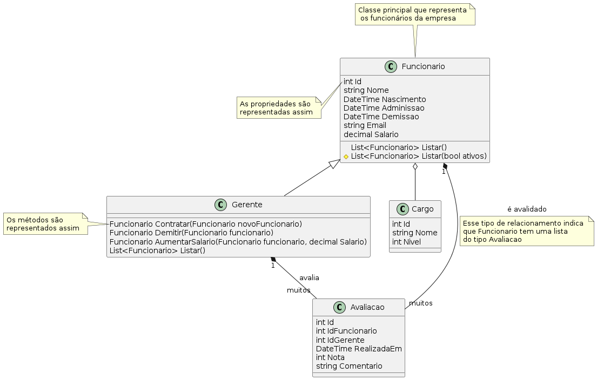

<style>
section {
    justify-content: start;
}

img[alt$="<"] {
    float: left;
    margin-right: 2em;
    }

img[alt$="center"] {
    display: block;
    margin: 0 auto;
    }
</style>

<style scoped>section { justify-content: center; }</style>

# Educafro Tech
## Curso C# - Do Básico ao MVC
### Aula 8
---
# Agenda
1. Introdução à Programação e Ambiente de Desenvolvimento
2. Fundamentos da Programação em C#
3. **Programação Orientada a Objetos (POO)**
4. Desenvolvimento Web com ASP.NET MVC
5. Banco de Dados e Entity Framework
6. Construção de um Aplicativo Web MVC
7. Implementando Recursos Avançados
8. Melhores Práticas e Testes
9. Projetos e Aplicações Futuras

---
<style scoped>section { justify-content: center; }</style>

### 3. Programação Orientada a Objetos (POO)
#### UML

---

#### Introdução

A partir de agora vamos desenvolver um projeto real! Um sistema de **Gestão de Pessoas**!

A empresa que te contratou, para esse desenvolvimento, quer gerenciar:

1. Lista de funcionários da empresa
2. Contratação e Demissão
3. Aumentos
4. Avaliações

Mas antes de sairmos programando milhares de linhas de código, uma importante parte do nosso trabalho é a **Análise e Planejamento**

E para nos ajudar, existem uma ferramenta chamada **UML**.

---

#### UML

>A UML é uma linguagem-padrão para a elaboração da estrutura de projetos de software. Ela poderá ser empregada para a visualização, a especificação, a construção e a documentação de artefatos que façam uso de sistemas complexos de software.

Enquanto escrever código é algo trabalhoso e que, muitas vezes depois de feito, temos **resistência** em fazer mudanças, desenhar é algo que dá maior flexibilidade para validar e adaptar melhor nosso sistema à necessidades do negócio.

---

#### UML

A UML se baseia em diagramas para representar **Classes e Objetos** do nosso sistema.

Para desenhar diagramas UML você pode usar a extensão **PlantUML** do Visual Studio Code, mas essa parte não será ensinada nesse curso. Mas, se quiser saber mais sobre, acesse: https://www.youtube.com/watch?v=WSC1K_rDf2w

---

#### UML

O primeiro passo para desenvolver um sistema é entender bem a necessidade do seu cliente.

No nosso caso, já sabemos a lista de funções que o sistema deve ter.

Mas vamos para mais alguns detalhes.

---

#### Dados

As informações que o sistema deve armazenar são:

1. Funcionários: Nome completo, email, cargo, salário e se ele é um funcionário ativo ou não.
2. Gerentes: Deve ter as mesmas informações dos funcionário.
3. Avaliações: Funcionário avaliado, gerente avaliador, data da avaliação, nota (1 a 10) e comentário do avaliador
4. Cargo: Nome e Nível (onde nível 1 = Funcionário e 2 = Gerente)

---

#### Funcionalidades

1. Contratação: Somente um gerente pode contratar um funcionário. Para contratar um novo funcionário, todos dados pessoais devem ser informados. Um funcionário só pode ser contratado uma única vez e só pode ter um único cargo.
2. Demissão: Somente um gerente pode demitir. Um funcionário só pode ser demitido se a média das suas avaliações for menor que 5.
3. Aumento: Um funcionário só pode receber um aumento se a média das suas avaliações for maior que 7.
4. Avaliação: Somente um gerente pode avaliar um funcionário.
5. Cargos: Cargos só podem ser criados por gerentes.

---

#### Funcionalidades

e por fim:

6. Listagens: Todos podem consultar funcionários ativos, porém, somente o gerente pode ver funcionários demitidos.

---

#### Diagrama de classes

Desenhando essas regras em um digrama de classes UML temos:



---

#### Diagrama de classes

Vamos começar pelo mais simples.

No centro do diagrama temos a classe ```Cargo```.

Ela é muito simples. Tem apenas 3 propriedades. A primeira é o ```Id```. Note que essa propriedade não foi pedida pelo cliente mas é muito importante no desenvolvimento de qualquer sistema.

**Id** vem de **Id**entificador. Ou seja, mesmo que se tenha dois cargos com o mesmo nome ou nomes muito parecidos, o ```Id``` tornaria eles diferentes.

O ```Id``` mais comum que você conhece é, provavelmente o CPF. Ele é um número único para cada cidadão brasileiro. Mesmo que duas pessoas tenham o mesmo nome, seus CPFs serão diferentes.

---

#### Diagrama de classes

Note que todas as classes tem essa propriedade ```Id```. E que todas elas são do tipo ```int```. Isso significa que elas são números inteiros e sequenciais. O primeiro cargo será o 1, o segundo o 2 e assim sucessivamente.

Além disso ela tem o ```Nome``` e o ```Nivel``` conforme especificado pelo cliente.

Observe que há uma linha saindo dela e apontando para a classe ```Funcionário```. Esse tipo de associação, com um losangolo branco na ponta, representa que além das propriedades de descritas, ```Funcionário``` tem mais uma propriedade do tipo ```Cargo```.

---

#### Diagrama de classes

Agora vamos analisar a classe ```Funcionario```. Já aprendemos que a associação que ela possui com ```Cargo``` faz com que ela tenha uma propriedade adicional além das listadas. E que ```Id``` é um número inteiro sequencial para identificar os funcionários.

Adicionalmente temos as outras propriedades com uma novidade. O tipo ```DateTime```, que representa uma data e hora.

Temos também outras duas associações com a classe ```Funcionario```. A linha com o losangolo preto, representa que um funcionário pode ter muitas ```Avaliações```. Já a linha com uma seta branca, indica que ```Gerente``` é uma classe filha de funcionário. Lembra? **Herança**.

---

#### Diagrama de classes

Na classe ```Funcionário``` temos ainda dois métodos ```Listar```. Um que recebe um parâmetro do tipo ```bool``` que significa um operador lógico, ou seja ***verdadeiro** ou **falso**.

Note que ele possui um losango amarelo ao seu lado. Isso indica que somente ```Funcionário``` e suas filhas podem enxergar essa função. Ela é ```protected```.

Já o outro método ```Listar``` não tem losango, ou seja, é público e pode ser usado em qualquer lugar do sistema e não tem parâmetros. Ele vai ser usado para retornar somente funcionários ativos.

---

#### Diagrama de classes

A classe ```Gerente```, além das propriedades que possui por **herança**, também possui alguns métodos. ```Contratar``` que recebe um novo ```Funcionario``` a ser contratado. ```Demitir``` que recebe o ```Funcionario``` que será demitido. ```AumentarSalario``` que recebe o ```Funcionario``` que terá o aumento e o valor do novo ```Salario```. E por fim ```Listar``` que **sobrescreve** (Lembram? **Polimorfismo**) a função da classe mãe para poder listar também os funcionários demitidos.

Quando um objeto do tipo ```Gerente``` chamar o método ```Listar```, na verdade estará chamando o método ```protected List<Funcionario> Listar(bool somenteAtivos)``` informando ```true``` ou seja, verdadeiro, no parâmetro. 

---


> Para simplificar, não apliquei um conceito que gosto bastante:
Em todas as classes ter data de criação, data da última modificação, quem criou e quem modificou cada classe. Imagine que meses depois de uma alteração alguém pergunte, *"quem aumentou o salário do funcionário João?"* Sem essas informações, será impossível responder.

---

<style scoped>section { justify-content: center; }</style>

# Muito obrigado
## E nos vemos na próxima aula! 👋


