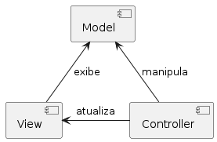
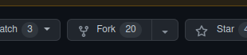

<style>
section {
    justify-content: start;
}

img[alt$="<"] {
    float: left;
    margin-right: 2em;
    }

img[alt$="center"] {
    display: block;
    margin: 0 auto;
    }
</style>

<style scoped>section { justify-content: center; }</style>

# Educafro Tech
## Curso C# - Do Básico ao MVC
### Aula 9
---
# Agenda
1. Introdução à Programação e Ambiente de Desenvolvimento
2. Fundamentos da Programação em C#
3. Programação Orientada a Objetos (POO)
4. **Desenvolvimento Web com ASP.NET MVC**
5. Banco de Dados e Entity Framework
6. Construção de um Aplicativo Web MVC
7. Implementando Recursos Avançados
8. Melhores Práticas e Testes
9. Projetos e Aplicações Futuras

---
<style scoped>section { justify-content: center; }</style>

### 4. Desenvolvimento Web com ASP.NET MVC
#### Arquitetura MVC

---

#### Introdução

> Um padrão de design para alcançar uma separação clara de preocupações

Fonte: https://dotnet.microsoft.com/pt-br/apps/aspnet/mvc

Assim como as funções devem ser específicas, todas as partes de um sistema devem ter uma preocupação específica.

Existem vários modelos que se propõem as resolver este problema, mas em C#, um dos mais populares é o **MVC**.

---

#### Arquitetura



Nesse diagrama temos os três componentes do MVC. Cada um com uma preocupação específica.

**Model**: Responsável por representar todos os dados da aplicação. Ex.: Funcionário
**View**: Responsável por definir as telas da nossa aplicação. Ex.: Tela de contratação.
**Controller**: Responsável por gerenciar as ações que acontecem na nossa aplicação.

---

#### Criando uma aplicação MVC

Acesse: https://github.com com seu usuário e senha.

Agora acesse: https://github.com/robertoosantos/abantu
Esse é o nosso projeto. *Abantu*, em zulu, significa "pessoas".

Normalmente, quando você vai trabalhar em uma empresa, eles já possuem diversos projetos. Vai ser mais comum que você tenha que dar manutenção ou evoluir um projeto existente, do que criar um novo projeto.

Uma das formas de trabalhar em um projeto existente é o *Fork*.

Com o *Fork* você faz uma cópia do projeto para seu perfil e tem liberdade para desenvolver sem se preocupar em atrapalhar o projeto principal ou outros desenvolvedores.

---

#### Criando uma aplicação MVC

No canto superior direito, clique em *Fork*. 

Depois clique no botão ***Create Fork***.

Agora você tem uma cópia do repositório exclusiva para você.

> Existem outras formas de organizar projetos e times de desenvolvimento. Para saber mais, leia: https://www.atlassian.com/br/git/tutorials/comparing-workflows/gitflow-workflow

---

#### Criando uma aplicação MVC

Agora vamos fazer o processo de ```clone```, assim como fizemos no projeto Sanduiche.

E vamos abrir o projeto no Visual Studio Code.

Por boa prática, vamos criar uma pasta chamada **src**. src é uma abreviação para ***source*** que é como é chamado o código do seus programas.

Agora vamos abrir o **Terminal** e usar novamente o comando ```dotnet new```.

Mas dessa vez, vamos usar o ```dotnet new sln```. sln é a abreviação para ***solution***. Uma solução é um conjunto de projetos que fazem parte de um sistema.

No terminal, acesse o diretório **src** com o comando: ```cd src```.

Depois execute o comando ```dotnet new sln -n abantu```.

---

#### Criando uma aplicação MVC

Note que na pasta **src** surgiu um novo arquivo com o nome abantu.

Agora na pasta **src** crie uma nova pasta chamada **abantu.mvc**.

No terminal, acesse a pasta **abantu.mvc**. E vamos usar novamente o comando ```dotnet new```. Mas dessa vez, vamos usar o ```dotnet new mvc -au Individual```.

```-au Individual```, é um parâmetro utilizado para criar um projeto do tipo MVC, já com funções de cadastro e permissões de usuário.

Vamos executar o projeto para ver tudo que o .Net já fez pra gente.

Para isso execute o comando: ```dotnet run```.

---

#### Criando uma aplicação MVC

Novamente na pasta **src** crie uma nova pasta chamada **abantu.tests**.

No terminal, acesse a pasta **abantu.tests**. E vamos usar novamente o comando ```dotnet new```. Mas dessa vez, vamos usar o ```dotnet new xunit```.

Esse será nosso projeto de testes.

Pare a execução do nosso site, clicando no terminal e digitando **CTRL+C**.

Acesse a pasta **abantu.tests** com o comando: ```cd ../abantu.tests/```.

E execute o comando ```dotnet new xunit```.

---

#### Criando uma aplicação MVC

Finalmente vamos adicionar nossos projetos na nossa solução.

No terminal, retorne para a pasta **src** com o comando ```cd ..```.

Para adicionar um projeto numa solução, use o comando: ```dotnet sln add```.

Para adicionar o projeto **mvc**, execute o comando: ```dotnet sln add abantu.mvc```.

Adicione também o projeto **tests**.

Agora, para confirmar que tudo deu certo, execute o comando ```dotnet build```. Esse comando transforma nosso código num programa de computador.

O resultado deve ser:

---

#### Criando uma aplicação MVC

```
dotnet build
MSBuild version 17.8.3+195e7f5a3 for .NET
  Determining projects to restore...
  All projects are up-to-date for restore.
  abantu.tests -> /workspaces/abantu/src/abantu.tests/bin/Debug/net7.0/abantu.tests.dll
  abantu.mvc -> /workspaces/abantu/src/abantu.mvc/bin/Debug/net7.0/abantu.mvc.dll
```

---


<style scoped>section { justify-content: center; }</style>

# Muito obrigado
## E nos vemos na próxima aula! 👋


